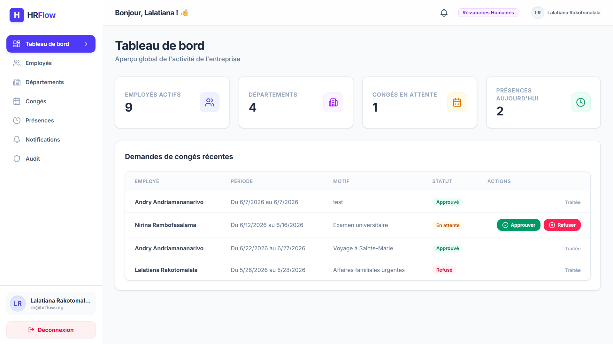
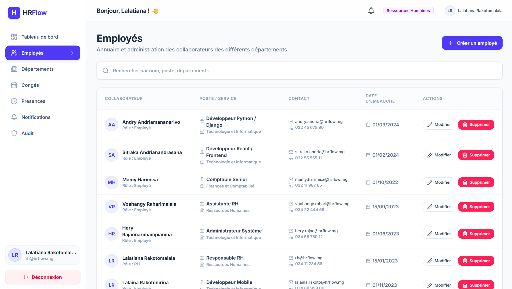
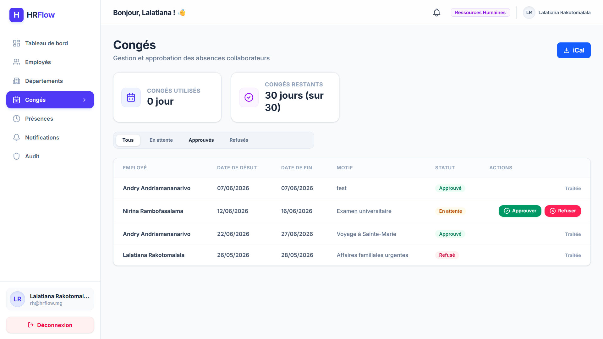
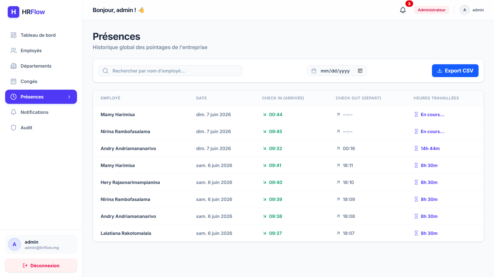
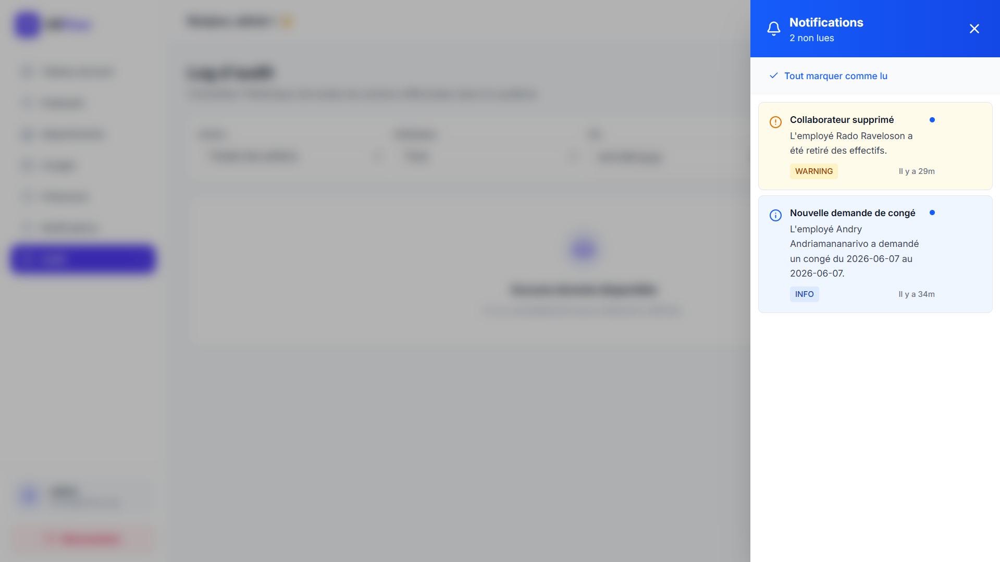
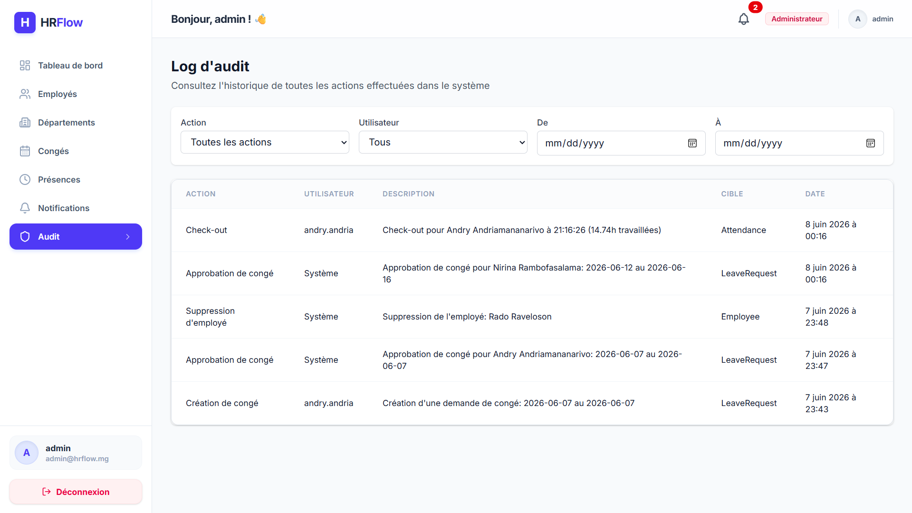

# HRFlow

## Système de Gestion des Ressources Humaines

HRFlow est une application web de gestion des ressources humaines développée dans le cadre d'un projet de Licence 3 en Informatique et Génie Logiciel.

L'objectif du projet est de centraliser les opérations RH d'une entreprise à travers une plateforme moderne permettant la gestion des employés, des départements, des congés, des présences, des notifications et du suivi des activités.

---

## Aperçu du Projet

HRFlow fournit un environnement unique permettant aux administrateurs, responsables RH et employés de collaborer efficacement au sein de l'entreprise.

Le système repose sur une architecture Full Stack moderne utilisant Django pour le backend et React pour le frontend.

---

## Fonctionnalités

### Authentification et Sécurité

* Authentification basée sur JWT
* Gestion des rôles et permissions
* Protection des routes et des ressources sensibles
* Rafraîchissement automatique des tokens
* Contrôle d'accès selon le profil utilisateur

### Gestion des Employés

* Création d'employés
* Modification des informations
* Suppression des employés
* Recherche et filtrage
* Gestion des postes et coordonnées

### Gestion des Départements

* Création de départements
* Modification des départements
* Suppression des départements
* Association des employés aux départements

### Gestion des Congés

* Soumission de demandes de congé
* Validation ou rejet des demandes
* Calcul automatique du solde de congés
* Suivi de l'historique des congés
* Export des congés au format iCal

### Gestion des Présences

* Check-in
* Check-out
* Calcul automatique du temps de travail
* Historique des présences
* Export CSV pour la paie

### Centre de Notifications

* Notifications automatiques liées aux événements métier
* Marquage comme lu
* Suppression des notifications
* Compteur de notifications non lues

### Journal d'Audit

* Enregistrement des actions importantes
* Consultation de l'historique des opérations
* Filtrage par utilisateur
* Filtrage par type d'action
* Filtrage par période

### Tableau de Bord

* Statistiques globales
* Suivi des congés
* Présences du jour
* Activités récentes
* Solde de congés

---

## Architecture Technique

### Backend

Technologies utilisées :

* Python 3
* Django 5
* Django REST Framework
* Simple JWT
* MySQL
* SQLite (développement)

Architecture :

```text
backend/
│
├── apps/
│   ├── accounts/
│   ├── employees/
│   ├── departments/
│   ├── leaves/
│   ├── attendance/
│   ├── notifications/
│   ├── audit/
│   └── dashboard/
│
├── config/
└── manage.py
```

---

### Frontend

Technologies utilisées :

* React 18
* Vite
* Tailwind CSS
* Axios
* React Router

Architecture :

```text
frontend/
│
├── src/
│   ├── api/
│   ├── components/
│   ├── context/
│   ├── hooks/
│   ├── layouts/
│   ├── pages/
│   ├── routes/
│   └── utils/
│
└── public/
```

---

## Modèle de Rôles

### Administrateur

* Gestion complète de l'application
* Gestion des utilisateurs
* Consultation du journal d'audit
* Gestion des départements
* Gestion des employés

### Responsable RH

* Gestion des employés
* Validation des congés
* Consultation des statistiques
* Consultation du journal d'audit

### Employé

* Consultation de son profil
* Demande de congés
* Consultation de son historique
* Gestion de ses présences

---

## Technologies

### Backend

* Django
* Django REST Framework
* JWT Authentication
* MySQL
* SQLite

### Frontend

* React
* Vite
* Tailwind CSS
* Axios
* React Router

### Outils

* Git
* GitHub
* Render
* Vercel

---

## Installation

### Cloner le projet

```bash
git clone https://github.com/votre-compte/hrflow.git
cd hrflow
```

---

### Backend

```bash
cd backend

python -m venv .venv

# Windows
.venv\Scripts\activate

# Linux / Mac
source .venv/bin/activate

pip install -r requirements.txt

python manage.py migrate

python manage.py createsuperuser

python manage.py runserver
```

Le backend sera disponible sur :

```text
http://localhost:8000
```

---

### Frontend

```bash
cd frontend

npm install

npm run dev
```

Le frontend sera disponible sur :

```text
http://localhost:5173
```

---

## Variables d'Environnement

### Backend

Créer un fichier `.env`

```env
DEBUG=True

SECRET_KEY=your-secret-key

DB_ENGINE=mysql

DB_NAME=hrflow

DB_USER=root

DB_PASSWORD=password

DB_HOST=127.0.0.1

DB_PORT=3306
```

---

## Déploiement

### Backend

Plateforme recommandée :

* Render

### Frontend

Plateforme recommandée :

* Vercel

---

## Tests

Backend :

```bash
python manage.py test
```

Frontend :

```bash
npm run build
```

---

## Compétences Démontrées

Ce projet met en œuvre les compétences suivantes :

* Développement Full Stack
* Conception d'API REST
* Authentification JWT
* Gestion des rôles et permissions
* Modélisation de bases de données relationnelles
* Intégration Frontend / Backend
* Gestion des états React
* Architecture logicielle modulaire
* Déploiement Cloud
* Audit et traçabilité des actions
* Génération de rapports CSV et iCal

---

## Captures d'Écran

### Dashboard


### Gestion des Employés


### Gestion des Congés


### Présences


### Notifications


### Audit Log


---

## Auteur

Zo Manoa Rajaonah

Projet académique réalisé dans le cadre de la Licence 3 Informatique et Génie Logiciel.